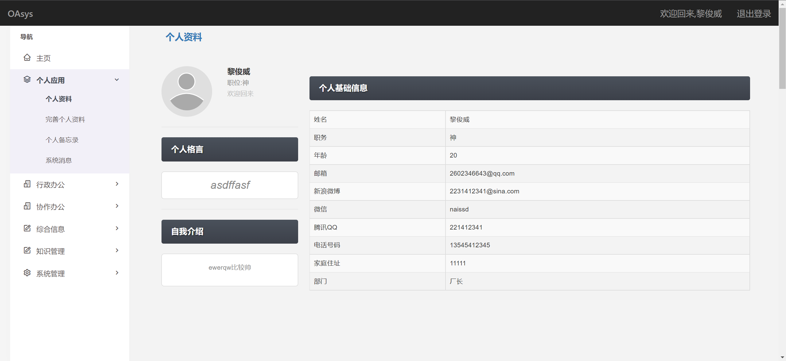
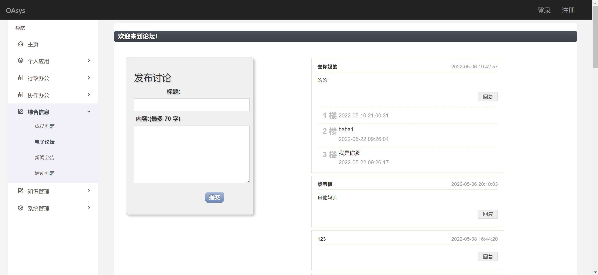

### **oasys(OA自动化办公系统)**

​	办公自动化（OA）是面向组织的日常运作和管理，员工及管理者使用频率最高的应用系统，极大提高公司的办公效率。OA系统（Office Automation），即办公自动化系统，是一种应用于办公领域的新型无纸化办公系统。

​	它利用计算机、通信等现代化技术来数字化地创建、收集、存储、处理办公任务所需的各种信息，代替办公人员传统的部分手动或重复性业务活动，最大限度地提高工作效率和质量、改善工作环境。


### 1.项目介绍

#### 	1.1项目功能

​		其主要功能就是进行后台管理模块的整合；主要分为主页、个人应用、行政办公、协作办公、综合信息、知识管理、系统管理几大模块，下面对各个模块逐一做简要介绍。

##### 		1.1.1支持展示个人资料

​			该模块里有个人的基本信息，自我介绍，个人业绩报表以及个人格言等内容

​             

##### 		1.1.2支持展示个人备忘录

​			该模块包含了重要三件事，备忘录和中国时间，中国时间为实时时间

##### 		1.1.3支持展示系统消息

​			系统消息可由厂长编辑并发出.

##### 		1.1.4支持上传知识仓库

​			支持的文件类型有：'jpg', 'jpeg', 'png', 'gif', 'txt', 'doc', 'docx', 'md'等

​             

##### 		1.1.5支持展示请假申请

​			请假申请所展示的是所有已申请的列表，通过对请假人员的公示从而起到督促的作用

##### 		1.1.6提交请假申请

​			由于个人原因的请假申请，由厂长可以批准，提交后在请假申请列表中予以展示

##### 		1.1.7成员列表

​			该成员列表是本办公系统内的所有成员的基本信息列表。支持查询功能，分页功能

##### 		1.1.8电子论坛

​           正如其名，是电子论坛！实现了主楼的发布以及对楼主的回复，任何人都能看见，但只有登陆后有权限发言。

##### 		1.1.9新闻公告

​            可以看见厂长等级的管理员发布的新闻公告，及时了解动态实事。

##### 		1.1.10活动列表

​			里面列出的是厂里的最新活动，活动可以由厂长创建

##### 		1.1.11知识仓库

​	知识仓库可以进行知识的共享，达到资源的高效利用

##### 		1.1.12成员权限管理

​			这一模块只有厂长等级可以看见，在这个模块中可以展示每一个成员的基本信息，厂长可以对他们进行相关操作，如升职，降职，踢出成员等等。

##### 		1.1.13添加新闻

​			能够实现发布新闻，即新闻自拟标题内容的发布，使所有人可见，这一模块只有厂长等级可以看见。

##### 		1.1.14修改新闻

​			可以实现对已发布新闻标题，内容的修改或对新闻本体的删除，这一模块只有厂长等级可以看见。

##### 		1.1.15管理论坛

​			可进行论坛中主楼的删除，这一模块只有厂长等级可以看见。

### 2.框架介绍

#### 项目结构

oasys是一个OA办公自动化系统，项目采用基于bootstrap和jQuery框架开发，mysql底层数据库。采用Bootstrap作为前端UI框架，原生css进行样式修改，前后端主要用php进行交互。

下面对前端和后端分别进行介绍

#### 前端

|   技术    |         名称         | 版本 |
| :-------: | :------------------: | :--: |
| bootstrap |      前端UI框架      |      |
|  jQuery   | 快速的JavaScript框架 |      |
|    cv     |                      |      |

前端采用响应式布局，主色调为后台管理系统的通用色调黑白色为主，页面整洁清爽，大方自然。

利用iframe实现多页面在主页面中展示

##### 登录模态框采用Ajax进行前后端交互，通过对数据库中的部门不同从而实现厂长与员工的区分，从而使得厂长和员工有不同的操作权限。

localstorage存储回调函数返回的信息，通过该缓存对页面的相应内容进行同步。


#### 后端

**成员管理**

对成员数据的查找，展示，与去除和修改

**如下部分类似成员管理**

发布活动，发布系统公告，活动列表，成员列表，请假申请，提交请假申请，个人资料，完善个人资料，个人备忘录，系统消息。

**主页图表展示**

网上查找html模板，在其中进行php的添加，同时在数据库中录入表单和数据显示到该模板中。

### 3.部署流程

```
	1.下载项目，解压压缩包，新建数据库register,news和users并分别把register.sql,news.sql以及users.sql导入这两个数据库中
	2. 修改用户名为“root”,密码为“123456”或自行将大多数php文件中的连接数据库一栏自行修改为自己的账号密码。
	3. 在浏览器中输入localhost:8081/index.html
```


### 4.项目截图








